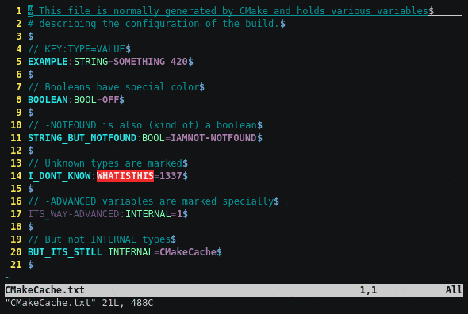

`CMakeCache.txt` Syntax for vim
===============================

This plugin makes your `CMakeCache.txt` colourful.

A `CMakeCache.txt` file is a "cache" that [CMake][cmake] generates for every
build.
It contains variables that describes the build, such as the options selected
and the compiler and their flags.

This simple vim plugin adds some syntax highligthing for that file.

Be sure to enable `:syntax on` and use `:set syntax=cmakec` if you want to
force to use this syntax highlighting for a file.

Or view it on [asciinema][an-demo].

Installing
----------

Use the plugin system you're using.

| Plugin Manager      |  Installing process                   |
|---------------------|---------------------------------------|
| [vim-plug][pm1]     | `plug 'Neui/cmakecache-syntax.vim'`   |
| [Vundle][pm2]       | `Plugin 'Neui/cmakecache-syntax.vim'` |

[cmake]: https://cmake.org/
[an-demo]: https://asciinema.org/a/XmA1o1nnsr4FpCWL5qzYffLHa
[pm1]: https://github.com/junegunn/vim-plug
[pm2]: https://github.com/VundleVim/Vundle.vim
[pm3]: https://github.com/tpope/vim-pathogen
